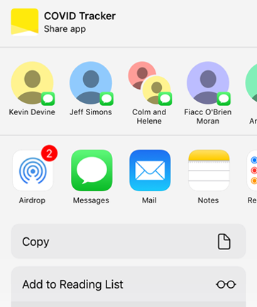

# Share Flow
_*Outcome: Getting Users to Share the App with their network*_
- App should allow the user to share the app via existing communication or social networking channels
- App should send a link along with a message to the selected channel
- App should raise an event to indicate that a user has shared the app

