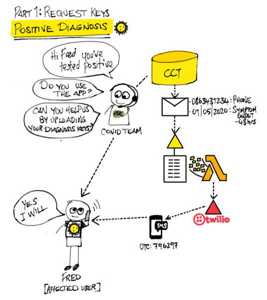
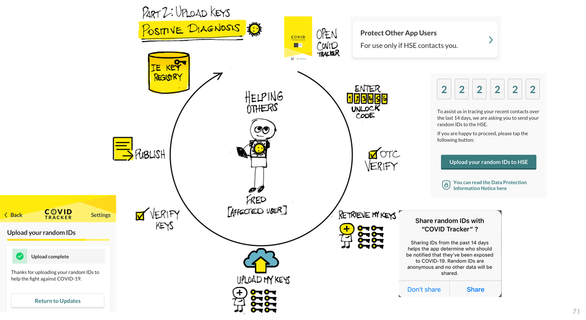

# Positive Test Result Flow
*Outcome: Get users diagnosis keys uploaded to share & protect other users*

*Positive Test Result Flow Call 1*

*Positive Test Result Flow Call 2*

- COVID Tracker App must allow Contact Tracing operations to send a user a code to upload their Diagnosis Keys
- App must ensure that user consents and accepts terms as part of the Upload
- App must allow users to enter a Contact Tracing Upload One time Code and
    - App must ensure that OTC can only be used once
    - App must ensure that OTC are used within a specified time period 15 minutes
- App must store Diagnosis Keys in IE Diagnosis Key Registry
- App should ensure that phone number and OTC are _NOT_ associated or linkable with the Diagnosis Key upload to preserve users privacy

*Positve Test Result Flow*

| **Path ID** | **Path**                                 | **App**                                                                                                                                       |
|-------------|------------------------------------------|-----------------------------------------------------------------------------------------------------------------------------------------------|
| 1           | User doesn’t receive OTC code text       | User should be provided information on how to request a new code from Contact Tracing operations                                              |
| 2           | User enters code and doesn’t upload keys | User should be provided another opportunity to request a code and upload keys                                                                 |
| 3           | OTC not used within specified time limit | User should be informed that OTC has expired User should be provided information on how to request a new code from Contact Tracing operations |
| 4           | OTC entered inaccurately by User         | User should be informed that OTC entered is invalid and asked to check & re-enter                                                             |

